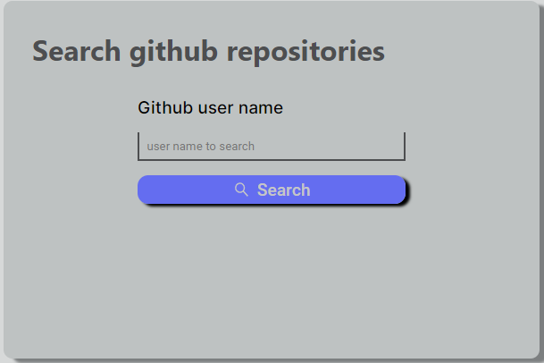
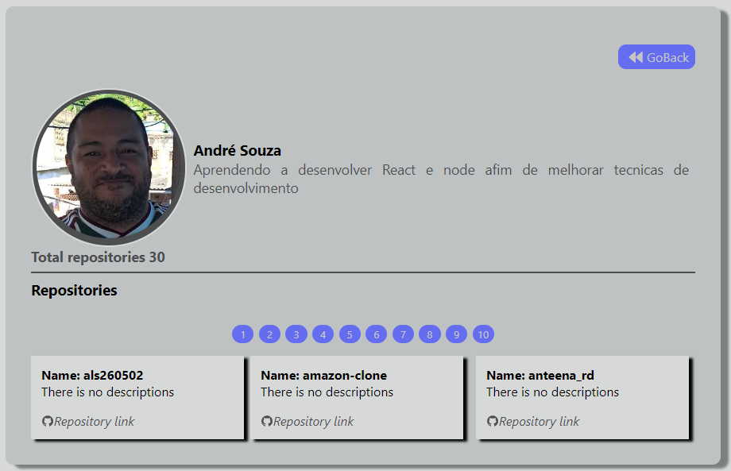
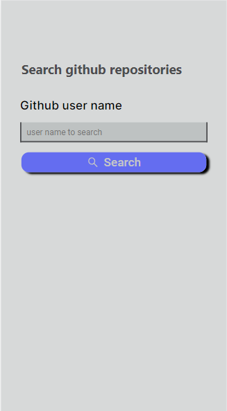
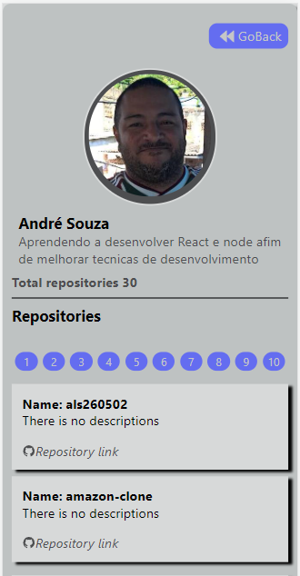

# Repository List

This repository contains the source code of the repository list tool .

## Usage

### run with docker compose

Just clone the repository and inside repository folder run

- docker compose up --build --force-recreate

- then open a browser and enter the address http://localhost:3000

### run without docker compose

- clone the repository
- enter repository folder
- run yarn install
- run yarn dev
- then open a browser and enter the address http://localhost:3000

## Frontend

The frontend is NextJS, Typescript and sass responsive web page.

### Principal used tools

- react hook form
- react context api
- react icons
- yup
- sass

---

## Desktop

  
    

## Mobile

  
    

